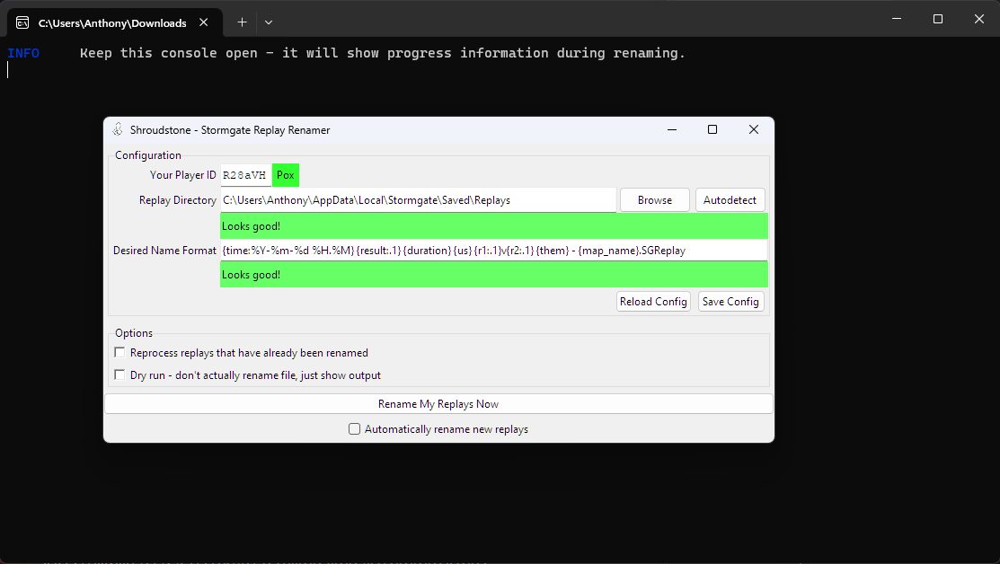

# shroudstone

[](https://pypi.org/project/shroudstone/)

Shroudstone is principally a tool to automatically rename replays of your
Stormgate ladder games.

Say goodbye to 

      CL44420-2024.02.03-08.28.SGReplay

and say hello to

      2024-02-03 08.28 L 03m03s Pox IvI Veni Vidi Vici - Broken Crown.SGReplay

Shroudstone also acts as a general Python/CLI toolkit for working with
Stormgate replays - right now it's probably not useful for much else, but
hopefully it will grow over time :)

## Caveats

Shroudstone works by decoding the contents of replay files, which contain
little more than the raw actions of each player. This means some of the
information that is used is technically a guess, and might not be 100%
accurate:

- 1v1 match results are determined by who leaves the game first. In most ladder
  games this is the loser "gging out"; but if you e.g. win by destroying all
  your opponent's buildings and then leave the game before your opponent,
  Shroudstone will incorrectly mark your game as a loss.
- Likewise, game durations are determined by the time at which the first player
  leaves the game - this can also be incorrect in the case of a win by
  elimination or in non-1v1 games.

Previously, Shroudstone used data obtained from the Stormgate World API to fill
these gaps (in the case of 1v1 ladder games). Unfortunately, Frost Giant are no
longer providing access to this data to the community,  so this will no
longer be possible going forward. See [Stormgate World's
post](https://stormgateworld.com/api-restrictions/) on the matter for more
information. Thanks to the Stormgate World team (and contributors) for their
great work, it was cool even if short-lived.

## Installation & Usage

### On Windows: .exe download

Simply [download the latest standalone
executable](https://github.com/acarapetis/shroudstone/releases/latest/download/shroudstone.exe)
and double-click it to launch the user interface. (The first time you do,
you'll probably get a Windows Defender SmartScreen popup - you did just
download some random program from the internet, after all! If you trust me,
click "More Info" and then "Run Anyway".)

Assuming you have a normal Stormgate install with a single account, everything
should be autodetected and you'll be faced with the main user interface:



Just click "Rename My Replays Now" to run the renaming process on your existing replays.

If you enable the checkbox "Automatically rename new replays" and leave
Shroudstone open in the background while you play, then the process will run
every 30 seconds, renaming new replays as they are created.

### On Windows: Using pip

1. Install Python 3.11 using
   [the Microsoft Store](https://apps.microsoft.com/detail/9nrwmjp3717k) or the
   [official installer](https://www.python.org/downloads/). If using the
   official installer, make sure to check the "add python.exe to PATH" option.
2. Open Command Prompt and type `pip install shroudstone` to install shroudstone.
3. You can now invoke `python -m shroudstone gui` from the command line to
   launch the user interface, or `python -m shroudstone --help` for usage
   instructions for the command-line interface.

If you're already a WSL user, you should also be able to `pip install
shroudstone` inside your WSL session and have at least the CLI work.

### On Linux: using pip

If you're running Stormgate on Linux+Steam+Proton, this should also work for
you!

1. Ensure python 3.8+ and pip are installed using your system package manager.
   (e.g. on Ubuntu, run `sudo apt install python3-pip`.)
2. Run `pip install shroudstone` in a terminal.
3. Launch the GUI with `shroudstone gui`, or check out `shroudstone --help` if
   you want to use the CLI.

### Updating

Regardless of your operating system, if you installed using `pip install
shroudstone` originally, you can update to the newest version with a simple
`pip install --upgrade shroudstone`.


If you downloaded the .exe, just download a new one to replace it!


## Notes

- Shroudstone can currently only rename 1v1 ladder games - this is because it
  relies on the Stormgate World API to fetch most of its information.
- Stormgate names your replays using your local time. After renaming, the times
  will be in the UTC timezone, as on the Stormgate World leaderboard.
- Your settings are saved in %LOCALAPPDATA%/shroudstone/config.json on Windows
  or ~/.local/share/shroudstone/config.json on Linux/WSL. Note that if you're
  using Python from the Microsoft Store, this %LOCALAPPDATA% might not be
  what you expect - use `python -m shroudstone config-path` to find out exactly
  where it is.
- If using the CLI, your replay directory path and replay format
  strings can be configured by passing command-line options to `python -m
  shroudstone rename-replays`; but you probably want to use the config file
  instead so you don't have to provide them every time. Use `python -m
  shroudstone edit-config` to edit the configuration file.


## Customizing replay names

You can customize the filenames of your renamed replays by editing the format
string in your configuration, either through the GUI or in your config file.

The default format string for 1v1 matches is

     {time:%Y-%m-%d %H.%M} {result:.1} {duration} {us} {f1:.1}v{f2:.1} {them} - {map_name}.SGReplay

which results in e.g.

      2024-02-03 08.28 L 03m03s Pox IvI Veni Vidi Vici - Broken Crown.SGReplay

Note the usage of `:.1` to take just the first letter of the race and result strings.

Format strings for 1v1 matches can use the following values:

* `us` (str): Your nickname (as it appeared in the replay)
* `them` (str): Opponent nickname (as it appeared in the replay)
* `f1` (str): Faction/Race you played (Vanguard or Infernals or Maloc or Blockade)
* `f2` (str): Faction/Race opponent played
* `time` (datetime): Creation time of match
* `duration` (str): Game duration (e.g. "15m10s")
* `result` (str): Your game result (Win, Loss, Undecided)
* `map_name` (str): Name of the map on which the game was played (extracted from replay file)
* `build_number` (int): Build number of Stormgate version on which the game was played (extracted from replay file)

For other matches (e.g. co-op), the default format string is

      {time:%Y-%m-%d %H.%M} {duration} {players_with_factions} - {map_name}.SGReplay

which results in e.g.

      2024-02-03 01:23 20m10s Pox M, Alice B, Bob M - WreckHavoc.SGReplay

Format strings for generic matches can use the following values:

* `players` (str): Comma-separated list of player nicknames
* `players_with_factions` (str): Comma-separated list of player nicknames, each
  followed by the initial letter of their faction (e.g. M for Maloc)
* `time` (datetime): Creation time of match
* `duration` (str): Game duration (e.g. "15m10s")
* `map_name` (str): Name of the map on which the game was played (extracted from replay file)
* `build_number` (int): Build number of Stormgate version on which the game was played (extracted from replay file)


## Contributing

Contributions are welcome - feel free to open a PR, or message Pox on the
Stormgate Discord if you want to discuss with me first.

### Developing

Assuming you have python 3.8+ and pip installed on your system, all you need to
do to start working on shroudstone is to clone the repository and install the
python package in *development mode*. [See
here](https://setuptools.pypa.io/en/latest/userguide/development_mode.html) for
more information, or follow this recipe to get started using a virtual
environment:

Create a working directory:
```
mkdir shroudstone-workspace
cd shroudstone-workspace
```
Download the code and setup a python virtual environment:
```
python -m venv .venv
git clone https://github.com/acarapetis/shroudstone.git
```
Finally, install and run the code:
```
.venv/bin/pip3 install -e shroudstone/
.venv/bin/shroudstone
```
